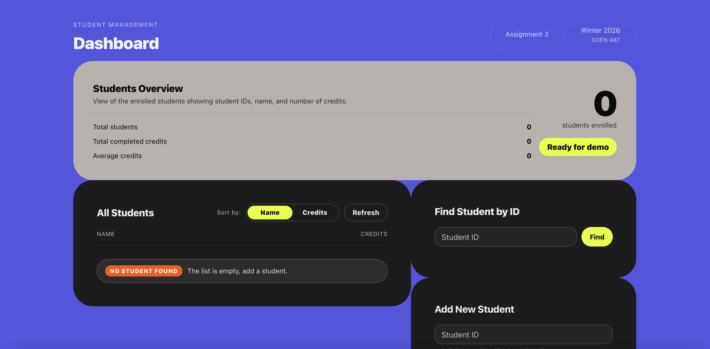
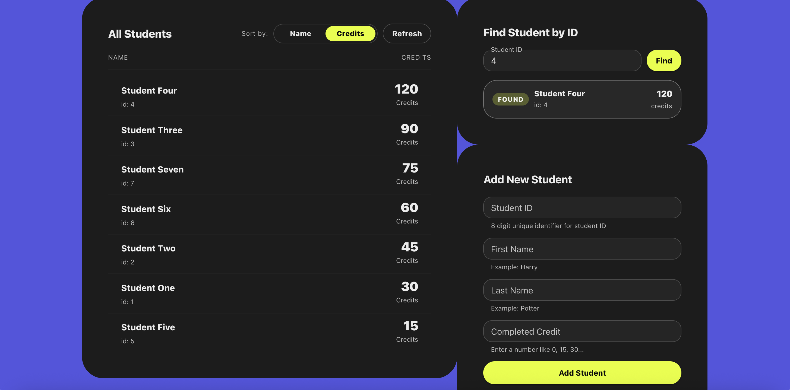
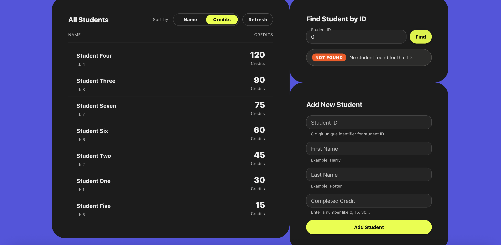
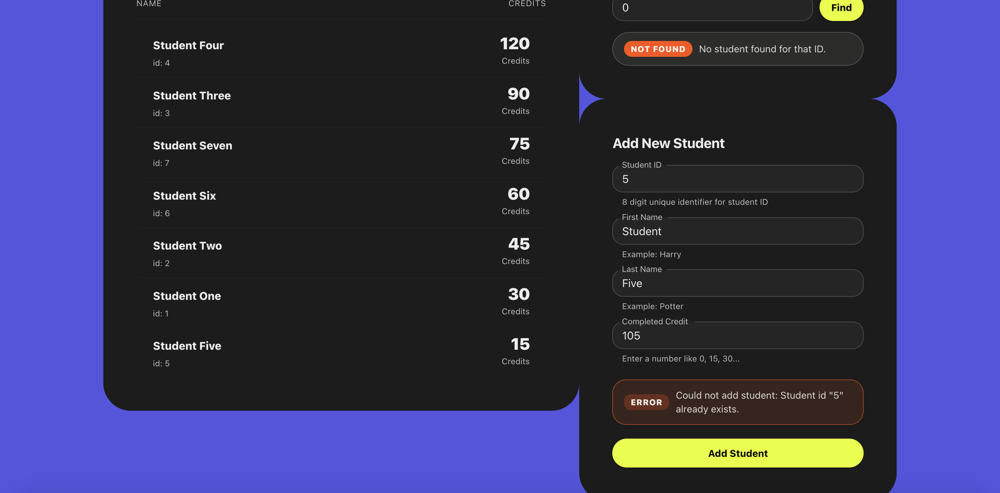
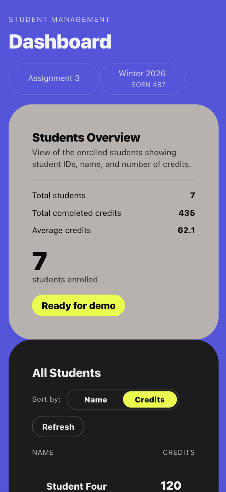
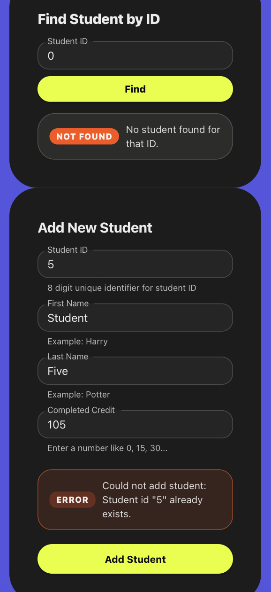

# SOEN487 - Assignment 3

- **Backend:** TypeScript + Express + Apollo Server (GraphQL) + MongoDB
- **Frontend:** Vite + React + TypeScript + Material UI (MUI)
- **Core features**
    - Retrieve all students
    - Retrieve a student by ID
    - Add a new student
---

## Screenshots

- Dashboard (desktop):

  
  
  
  
  

  - Dashboard (mobile):
 
    
    
    

---

## Setup Instructions

### Prerequisites

- Node.js (recommended: Node 18+)
- npm
- A MongoDB instance:
    - Local MongoDB, or
    - MongoDB Atlas connection string

---

## 1) Backend setup (GraphQL + MongoDB)

### Install dependencies

```bash
cd backend
npm install
```

### Create `.env`

Create a file at:

- `backend/.env`

Add the following:

```bash
MONGODB_URI="YOUR_MONGODB_CONNECTION_STRING"
MONGODB_DB="a3"
PORT=4000
```

Notes:
- `MONGODB_URI` is required. The server will fail fast if it’s missing.
- `MONGODB_DB` is optional in code (defaults to `"a3"`), but included here for clarity.
- `PORT` is optional in code (defaults to `4000`).

### Run backend

```bash
npm run dev
```

GraphQL endpoint:

- `http://localhost:4000/graphql`

---

## 2) Frontend setup (React)

### Install dependencies

Open a new terminal (keep the backend running):

```bash
cd frontend
npm install
```

### Run frontend

```bash
npm run dev
```

Vite dev server (default):

- `http://localhost:5173`

---

## 4) How to use

- **All Students**
    - View all students
    - Sort by name or credits
    - Refresh to re-fetch from the backend
- **Find Student by ID**
    - Enter a student ID and press **Find**
    - Shows a success / not found / error badge result
- **Add New Student**
    - Fill out the form and press **Add Student**
    - Duplicate IDs will be rejected

---

## Scripts (from `package.json`)

### Backend scripts (`backend/package.json`)

```bash
npm run dev    # Run backend in dev mode (ts-node-dev)
npm run build  # Compile TypeScript -> dist/
npm run start  # Run compiled server (node dist/index.js)
```

### Frontend scripts (`frontend/package.json`)

```bash
npm run dev      # Start Vite dev server
npm run build    # Typecheck + production build
npm run lint     # Run ESLint
npm run preview  # Preview the production build locally
```

---

## Environment Variables

### Backend: `.env.example`

Copy this file to `backend/.env` and fill in values.

- Required:
    - `MONGODB_URI`
- Optional:
    - `MONGODB_DB` (defaults to `a3`)
    - `PORT` (defaults to `4000`)

---

## Troubleshooting

### Backend error: `Missing MONGODB_URI in environment (.env).`
Create `backend/.env` and set `MONGODB_URI`.

### Frontend can’t connect to backend
- Confirm backend is running at `http://localhost:4000/graphql`
- The frontend endpoint is defined in:
    - `frontend/src/graphql.ts`

### Duplicate ID errors when adding a student
This is expected behavior. The backend enforces uniqueness of the domain student ID using a MongoDB unique index.

---

## Project Structure

- `backend/` — GraphQL server + MongoDB logic
- `frontend/` — React UI (MUI theme + components)

---

## Implementation Notes

- GraphQL `Student.id` is the **domain student ID** (stored in MongoDB as `studentId`), not MongoDB’s `_id`.
- The backend ensures uniqueness with:
    - a pre-check for existing IDs, and
    - a MongoDB unique index to prevent race-condition duplicates.
